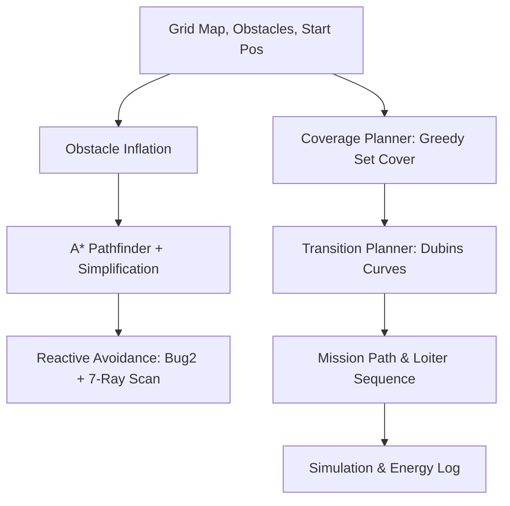

<div align="center">


<br/><br/>

[](#)
[](#)
[](#)
[](#)

<br/>

### *सुपर्ण — Autonomous Surveillance Path Optimization*

A bio-inspired fixed-wing UAS for persistent day/night battlefield reconnaissance.<br/>
Inspired by the **Common Swift** (*Apus apus*)—a bird that sustains unbroken flight for 10 months—SUPARNA encodes aerodynamic constraints directly into the path planning algorithm.

<br/>

---

</div>

<br/>

<!-- ═══════════════════ STAT CARDS ═══════════════════ -->

<div align="center">
<table>
<tr>
<td align="center" width="33%">
<br/>

<br/><br/>
<strong>Persistent Endurance</strong>
<br/>
<sub>Sea level battery-only ops</sub>
<br/><br/>
</td>
<td align="center" width="33%">
<br/>

<br/><br/>
<strong>Continuous Forward Flight</strong>
<br/>
<sub>Observation via loiter patterns</sub>
<br/><br/>
</td>
<td align="center" width="33%">
<br/>

<br/><br/>
<strong>Runway-Independent</strong>
<br/>
<sub>Controlled spiral descent</sub>
<br/><br/>
</td>
</tr>
</table>
</div>

<br/>

<!-- ═══════════════════ ALGORITHM TAGS ═══════════════════ -->

<div align="center">


<br/>


</div>

<br/>

---

## ⚡ The Problem: The High Cost of Hover

Every rotorcraft ISR drone in Indian tactical service wastes **70–80% of its energy** on *hovering* — the observation mission runs on the leftovers. This fundamentally restricts operations to 25–45 minute sorties, requires 6–8 battery swaps per 4-hour operation, and leads to operational collapse above 3,000m AMSL (like in Ladakh).

**This is a physics problem. No software update can fix it.**

<table>
<tr>
<td width="50%">
<h3 align="center">❌ Target-Centric (Traditional)</h3>
<br>

- Stop and hover over points of interest.
- Extreme energy drain fighting gravity.
- Rotor aerodynamic collapse at high altitudes.
- ~1 km² coverage per sortie.

</td>
<td width="50%">
<h3 align="center">✅ Motion-Centric (SUPARNA)</h3>
<br>

- Continuous circular loiter patterns.
- Thrust entirely forward-directed.
- +38% more coverage per joule.
- **~3 km² coverage per sortie** at ≥95% density.

</td>
</tr>
</table>

> *"SUPARNA converts energy directly into coverage — not hover. Every joule translates into ground observed."*

---

## 🦅 The SUPARNA Solution

SUPARNA tackles the challenge at the airframe level. Derived from the *Common Swift*, the platform is designed so that hover is structurally impossible.

### Key Innovations

<details open>
<summary><b>1. Physics-Constrained Coverage Engine (PCCE)</b></summary>
<br>
By encoding <em>forward-flight-only</em> as a hard physical reality, the PCCE never even considers hovering, sharp yaw corrections, or rapid 90° turns. The search space collapses, allowing rapid <code>O(1)</code> Dubins Curve transit generation and <code>O(k)</code> Greedy Set Cover placed loiters.
</details>

<details open>
<summary><b>2. Loiter-to-Land</b></summary>
<br>
Most fixed-wing platforms require a runway or parachute. SUPARNA uses its own observation circle as the landing pattern. When the mission ends, it spirals inside the same circle, descending 3–5m per loop until belly touchdown. Every loiter zone is a potential recovery point.
</details>

<details>
<summary><b>3. High-Altitude Persistence</b></summary>
<br>
At 4,000m AMSL (Ladakh), traditional rotorcraft endurance plummets to 15-20 mins. <strong>SUPARNA delivers 2.65 hours at 4,000m AMSL</strong> (vs. 3.25 hrs at sea level).
</details>

---

## ⚙️ System Specifications

| Parameter | Specification |
|:---|:---|
| 🪽 **Airframe Structure** | 210cm wingspan, CFRP fixed-wing, Common Swift crescent planform |
| 🚀 **MTOW & Power** | 3.5 kg MTOW <br> 6S4P Samsung 21700-50E (432 Wh, 1.66 kg) |
| ⏱️ **Endurance** | 3.25 hr *(Sea Level)* <br> 2.65 hr *(4,000m AMSL)* |
| 🎥 **Payload** | Dual EO/IR on 2-axis gimbal. <br> 4K EO (day) + FLIR Lepton 3.5 (LWIR, night) |
| 🧠 **Flight Control** | ArduPlane on Cube Orange+ (EKF3, Dual IMU) + RPi CM4 companion |
| 📡 **Comms (Triple-Link)**| 900MHz FHSS primary, 433MHz LoRa fallback, 868MHz RC override |
| 🔇 **Acoustic Signature** | <48 dB at 150m AGL (Covert ISR) |

---

## 💻 The Repository: PCCE Software Stack

This repository hosts the **Physics-Constrained Coverage Engine (PCCE)** — a standalone, platform-agnostic sovereign path planner validated in full 3D simulation.

<div align="center">
  <br>
  
  <br><br>
</div>



The algorithm yields optimal coverage efficiently via:

- **Greedy Set Cover**: Energy-weighted coverage grouping `Score = Coverage ÷ Energy`
- **Dubins Curves**: O(1) query for 6 curve archetypes `(LSL, LSR, RSL, RSR, RLR, LRL)` providing shortest provably flyable non-holonomic transition distances.
- **Bug2 Avoidance**: 7-ray raycasting for reactive navigation (NORMAL → AVOID → RECOVER).

---

## 🚀 Quick Start (Simulation)

You can run the simulated drone and PCCE path visualizer out-of-the-box.

```bash
# Clone
git clone https://github.com/404Avinash/suparna_beta.git
cd suparna_beta

# Install dependencies
pip install -r requirements.txt

# Run interactive simulation
python main.py
```

### Controls

| Key | Action |
|:---:|:-------|
| <kbd>SPACE</kbd> | Pause / Resume |
| <kbd>+</kbd> / <kbd>-</kbd> | Speed up / down |
| <kbd>R</kbd> | Reset mission |
| <kbd>ESC</kbd> | Exit |

To generate a robust LAC Border mission profile or randomly generated terrain for web visualization (Three.js compatible `mission.json`):

```bash
python export_mission.py --map lac --seed 42
```

---

## 📁 Repository Structure

```text
📦 suparna_beta
 ┣ 📜 main.py                     # Simulator Entry point
 ┣ 📜 export_mission.py           # Generate mission & export JSON
 ┣ 📜 IDEX_PROPOSAL.md            # Read the full project hardware proposal
 ┣ 📜 PROJECT_ARCHITECTURE.md     # Detailed software architecture & algorithms
 ┗ 📂 src
   ┣ 📂 core                      # Geometric utils, Dubins algorithms
   ┣ 📂 planners                  # Coverage, transition, reactive edge planners
   ┗ 📂 simulation                # Pygame visualization & drone state-machine
```

---

<div align="center">

### Tech Stack

[](https://python.org)
[](https://numpy.org)
[](https://pygame.org)

---

**Built within India.**

<br/>

Made with 🦅 by **Avinash Jha**

</div>
